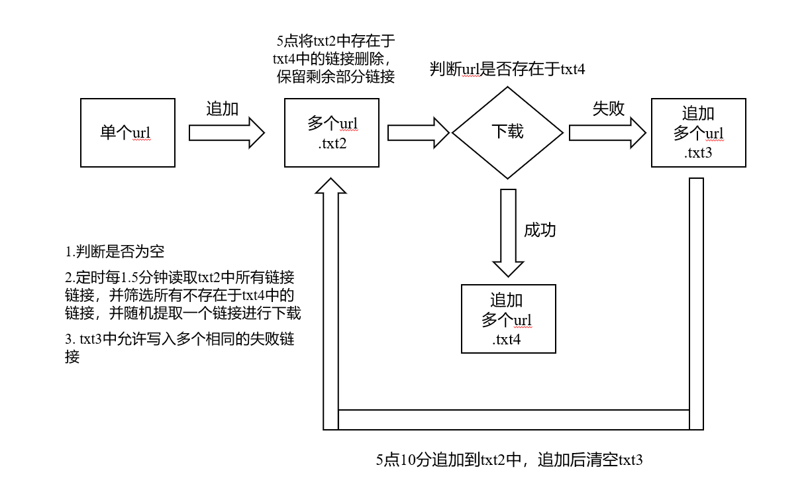

# 项目功能

异步下载抖音视频，不需要等待单个视频下载完成再提交下个视频链接，可以连续写入多个链接，存储到txt文件中，每隔固定时间读取下载


# 项目架构

- **架构**

<p align="center">
  
</p>

- **项目文件组成**

```
.
├── 01_url_get.php                   # web页面上提醒输入链接，写入到2.txt中
├── 02_douyinDown.py                 # 筛选2.txt中存在，4_success.txt中不存在的链接进行下载，定时每2分钟下载一次
├── 03_add_3_to_2.sh                 # 凌晨5.10分将3_failure.txt中的链接追加到2.txt中，并清空3_failure.txt
├── 04_2_subtract_4.py               # 凌晨5点，筛选2.txt中的链接，保存不存在于4_success.txt中的链接
├── 2.txt                            # 保存所有待下载的链接
├── 3_failure.txt                    # 保存下载失败的链接，定期追加到2.txt中，然后清空
└── 4_success.txt                    # 存储所有下载成功的链接，保证不重复下载

.
├── 02_douyVideo                     # 存储视频的文件夹
│   ├── 20231012-031208.mp4
│   ├── 20231012-031409.mp4
│   ├── 20231012-031608.mp4
│   ├── 20231012-031811.mp4
│   ├── 20231012-032009.mp4
│   ├── ...
```

- **文件权限**

```
-rw-r--r-- 1 root  root  2052 Oct 11 20:32 01_url_get.php
-rwxr-xr-x 1 root  root  2967 Oct 11 21:13 02_douyinDown.py
-rwxr-xr-x 1 root  root   515 Oct 11 21:30 03_add_3_to_2.sh
-rwxr-xr-x 1 root  root   674 Oct 11 21:29 04_2_subtract_4.py
-rw-rw-rw- 1 nginx nginx    0 Oct 12 05:00 2.txt
-rw-rw-rw- 1 root  root     0 Oct 12 05:10 3_failure.txt
-rw-rw-rw- 1 root  root  4867 Oct 12 03:20 4_success.txt

drwxrwxr-x  2 nginx nginx    65536 Oct 12 03:20 02_douyVideo
drwxr-xr-x  2 root  root       157 Oct 11 21:29 05_douyinAsynDload
```


# 环境配置

- **定时任务**

```
*/2 * * * * /home/00_software/01_Anaconda/bin/python /home/01_html/05_douyinAsynDload/02_douyinDown.py
0 5 * * * /home/00_software/01_Anaconda/bin/python /home/01_html/05_douyinAsynDload/04_2_subtract_4.py
10 5 * * * /usr/bin/bash /home/01_html/05_douyinAsynDload/03_add_3_to_2.sh
```

说明：

使用crontab写个定时任务，每隔2分钟执行一次 /home/01_html/05_douyinAsynDload/02_douyinDown.py，python路径为 /home/00_software/01_Anaconda/bin/python

使用crontab写个定时任务，每天5点的时候执行 /home/01_html/05_douyinAsynDload/04_2_subtract_4.py，python路径为 /home/00_software/01_Anaconda/bin/python

使用crontab写个定时任务，每天5点10分的时候执行 /home/01_html/05_douyinAsynDload/03_add_3_to_2.sh，bash路径为 /usr/bin/bash


- **01_url_get.php**

能否写一个php脚本，在web页面访问该php脚本的时候显示一个输入框，提示输入保存字符串，用户输入字符串并点击输入保存按钮后，程序会提取该字符串中的 https链接，并将该链接以追加的方式写入到 2.txt文件中。
下面是一个字符串例子，字符串通常是如下格式 “......”，只需要提取“https://v.douyin.com/abcdef/” 部分链接即可。


