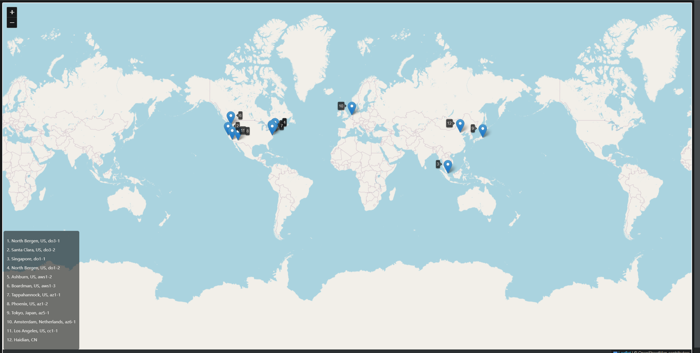
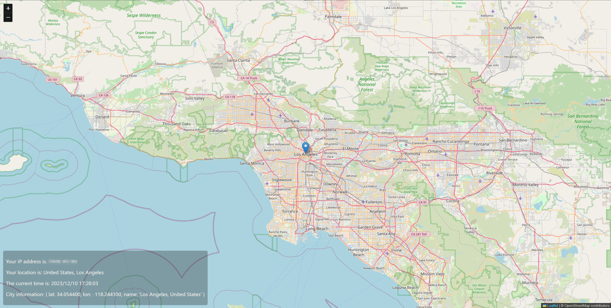
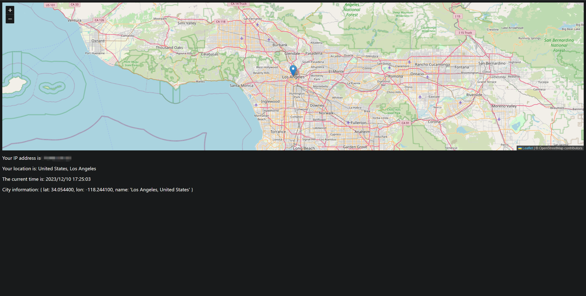

# 项目功能

基于ip地址获取国家、城市、经纬度等信息，然后在世界地图中进行标注

# 文件结构

```
01_worldMap.php          # 基于经纬度在世界地图中进行标注
02_ipToCity_ipapi.php    # 基于 https://ipapi.co/{$ip}/city/ 获取城市等信息
02_ipToCity.php          # 基于 https://ipinfo.io/{$ip}/json 获取相关信息，基于ip获取的位置信息似乎不太精确
03_ipCity_HS.php         # 上半屏显示地图及标注，下半屏显示文字信息
03_ipCity_FS.php         # 全屏显示地图及标注
```


# 环境配置

- **01_worldMap.php**

<p align="center">
  
</p>


- **02_ipToCity_ipapi.php**

在 `https://github.com/Yiwei666/02_javascript_cf-worker/blob/main/01_countdown.js` 代码基础上修改得到的

```
在页面最后一行显示经纬度以及国家和城市信息，City information 使用如下字典格式，
City information: { lat: 38.7135, lon: -78.1594, name: 'Washington, US' }
lat的值通过 https://ipapi.co/${ip}/latitude/ 获取
lon的值通过 https://ipapi.co/${ip}/longitude/ 获取
name 中的 国家 通过 https://ipapi.co/${ip}/country_name/ 获取，城市通过 https://ipapi.co/${ip}/city/ 获取
```

- **03_ipCity_FS.php**

地图全屏显示，然后页面显示的其他文字信息（location，time, ip, city information 等）显示在地图上，位于屏幕的左上角即可

<p align="center">
  
</p>


- **03_ipCity_HS.php**

<p align="center">
  
</p>


- **02_ipToCity.php 输出示例**

基于`https://ipinfo.io/{$ip}/json` 获取相关信息，Deadline信息 似乎不对，经纬度和城市信息基本是对的

```
Hello world

Your IP address is: 159.223.137.77

Your location is: US, North Bergen

The current time is: 2023-11-12 21:37:57

Deadline 11:30 has passed

Deadline 17:30 has passed

Deadline 22:0 has passed

Days until May 23rd, 2025: 557

Remaining time until May 23rd, 2025: 13370 hours (48133323 seconds)

City information: { lat: 40.8043, lon: -74.0121, name: 'North Bergen, US' }
```
